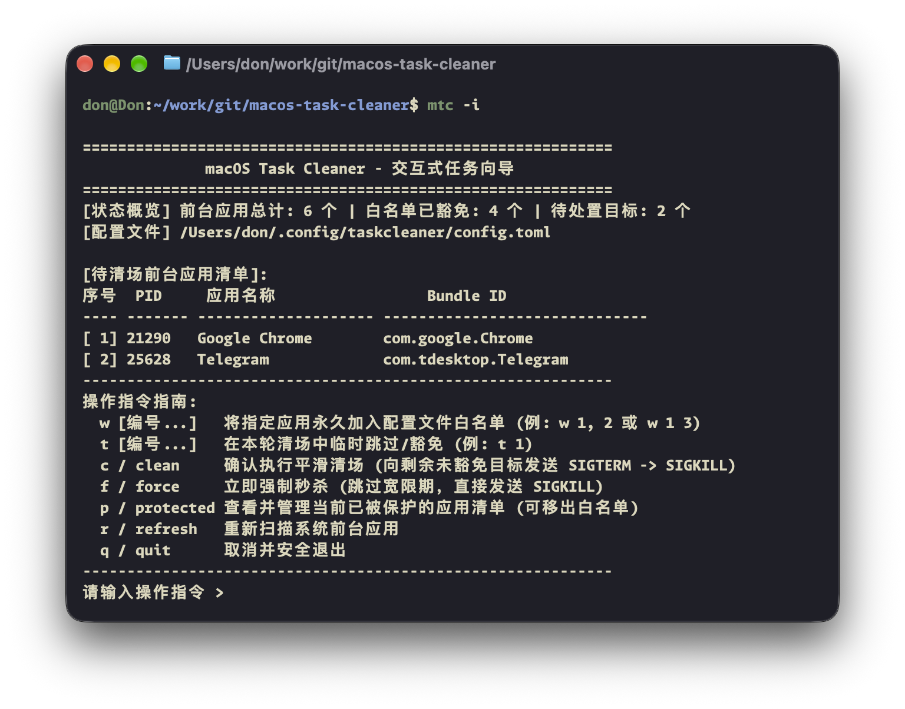

# macOS Task Cleaner CLI (`mtc` / `taskcleaner`)

<p align="left">
  <a href="README.md">English</a> | <a href="README_ZH.md">简体中文</a>
</p>

<p align="left">
  <a href="https://apple.com/macos"></a>
  
  <a href="https://www.rust-lang.org/"></a>
  
  
  <a href="LICENSE"></a>
  <a href="COMMERCIAL.md"></a>
</p>

A lightweight, production-grade foreground task cleaner and process management CLI for macOS. Built on top of the high-precision [macos-task-cleaner-core](https://github.com/macos-task-cleaner/macos-task-cleaner-core) engine.

---

## Interface Showcase

<p align="center">
  
</p>

---

## Key Features

* **Interactive Task Wizard (`-i` / `--interactive`)**: Clean keyboard-driven terminal dashboard displaying foreground applications with real-time whitelist evaluation and quick index-based actions.
* **Non-Intrusive POSIX Escalation**: Bypasses modal save/confirm dialogs by orchestrating orderly signal escalation (`SIGTERM` soft termination -> polling grace period -> `SIGKILL` fallback).
* **4-Tier Whitelist Defense**: Core OS (L1), caller session & active terminals/IDEs (L2), background utilities & input methods (L3), persistent configuration rules (L4).
* **Instant Whitelist Rule Addition (`-a` / `--add-whitelist`)**: Add rules directly from terminal commands or inside the interactive console.
* **Pre-Flight Dry Run (`-n` / `--dry-run`)**: Analyze running applications and filter matches without terminating processes. Supports `--json` output for Raycast and automation scripts.

---

## Installation

### 1. Pre-Built Standalone Binaries

Download the pre-compiled binary package directly from [GitHub Releases](https://github.com/macos-task-cleaner/macos-task-cleaner-cli/releases/latest):

| Architecture | Applicable Hardware | Direct Download Link |
| :--- | :--- | :--- |
| **Apple Silicon** (`arm64`) | Apple M1 / M2 / M3 / M4 Macs | [mtc-macos-arm64.tar.gz](https://github.com/macos-task-cleaner/macos-task-cleaner-cli/releases/latest/download/mtc-macos-arm64.tar.gz) |
| **AMD64 / Intel** (`x86_64`) | Intel-based Macs | [mtc-macos-x86_64.tar.gz](https://github.com/macos-task-cleaner/macos-task-cleaner-cli/releases/latest/download/mtc-macos-x86_64.tar.gz) |
| **Universal** (`universal`) | Compatible with all Macs | [mtc-macos-universal.tar.gz](https://github.com/macos-task-cleaner/macos-task-cleaner-cli/releases/latest/download/mtc-macos-universal.tar.gz) |

Extract and place into your PATH:

```bash
tar -xzvf mtc-macos-arm64.tar.gz
sudo mv mtc /usr/local/bin/   # or ~/.local/bin/
```

### 2. Build from Source

Requires Rust toolchain (1.75+):

```bash
git clone https://github.com/macos-task-cleaner/macos-task-cleaner-cli.git
cd macos-task-cleaner-cli

# Build release binary
cargo build --release

# Install binary to local path
cp target/release/mtc ~/.local/bin/

# (Optional) Create alias symlink
ln -sf ~/.local/bin/mtc ~/.local/bin/taskcleaner
```

---

## Usage Guide

### 1. Interactive Wizard Mode (Recommended)

```bash
mtc -i
# or
mtc --interactive
```

Interactive commands:
* `w [indices]`: Add specified applications permanently to the configuration whitelist (e.g. `w 1, 2` or `w 1 3`).
* `t [indices]`: Temporarily skip applications for the current cleaning cycle.
* `c` / `clean`: Confirm and execute smooth tiered cleanup.
* `f` / `force`: Immediate termination bypassing grace periods (`SIGKILL`).
* `p` / `protected`: Inspect currently protected applications and whitelist tiers.
* `r` / `refresh`: Rescan active foreground applications.
* `q` / `quit`: Cancel and exit safely.

### 2. Pre-Flight Preview (Dry Run)

```bash
mtc --dry-run

# Temporarily exempt specific applications
mtc -k "WeChat" -k "Google Chrome" --dry-run

# Structured JSON output for scripting
mtc --json --dry-run
```

### 3. Quick Whitelist Management

```bash
# Add by application display name
mtc -a "Slack"

# Add by Bundle Identifier (Recommended)
mtc -a "com.spotify.client" -a "com.google.Chrome"
```

### 4. Direct Cleanup Execution

```bash
# Execute standard tiered cleanup
mtc --execute

# Force immediate termination
mtc --force

# Purge inactive memory cache after cleanup
mtc --execute --purge
```

---

## Command-Line Arguments

```text
Usage:
  mtc [OPTIONS]   (or taskcleaner [OPTIONS])

Options:
  -i, --interactive         Interactive task wizard (Recommended: select by index, manage whitelist, confirm cleanup)
  -n, --dry-run             Pre-flight dry run mode (Scan and analyze without terminating processes)
  -e, --execute             Execute tiered cleanup sequence (SIGTERM -> polling -> SIGKILL)
  -f, --force               Force immediate termination bypassing grace periods (SIGKILL)
  -a, --add-whitelist <ID>  Add rule permanently to configuration whitelist (e.g. -a com.google.Chrome)
  -k, --keep <NAME/BUNDLE>  Temporarily exempt application for current invocation
  -p, --purge               Call /usr/sbin/purge after cleanup to reclaim inactive memory
  -c, --config <FILE>       Specify custom TOML configuration file path
      --init-config         Generate default configuration template at ~/.config/mtc/config.toml
      --json                Output results in structured JSON format
  -h, --help                Show help information
  -v, --version             Show version number
```

---

## Configuration

Configuration is located at `~/.config/mtc/config.toml` (compatible with `~/.config/taskcleaner/config.toml`):

```toml
[general]
grace_period_ms = 400
default_dry_run = false

[whitelist]
bundle_ids = [
    "com.google.Chrome",
    "com.spotify.client",
]

names = [
    "Telegram",
    "Slack",
]
```

---

## Related Projects

* **Core Engine Library (Rust)**: [macos-task-cleaner-core](https://github.com/macos-task-cleaner/macos-task-cleaner-core)
* **Native Menu Bar Application (Swift)**: [macos-task-cleaner-gui](https://github.com/macos-task-cleaner/macos-task-cleaner-gui)

---

## License & Commercial Terms

This project is dual-licensed:

1. **Open-Source License**: Licensed under the **GNU Affero General Public License v3.0 (AGPLv3)** for individual, academic, and non-commercial open-source usage. Under this license, any derivative work, modification, or network-accessible service utilizing this codebase must release its complete corresponding source code under the AGPLv3. See [LICENSE](LICENSE) for details.
2. **Commercial License**: For enterprise deployment, proprietary closed-source bundling, white-labeling, or integration into commercial utilities where AGPLv3 compliance cannot be met, a separate commercial license is required. See [COMMERCIAL.md](COMMERCIAL.md) for licensing terms and acquisition details.
3. **Trademark Policy**: All product names, logos, and icon assets are protected. Forked distributions must be de-branded. See [TRADEMARK.md](TRADEMARK.md).

Copyright (c) 2026 DonJone. All rights reserved.
