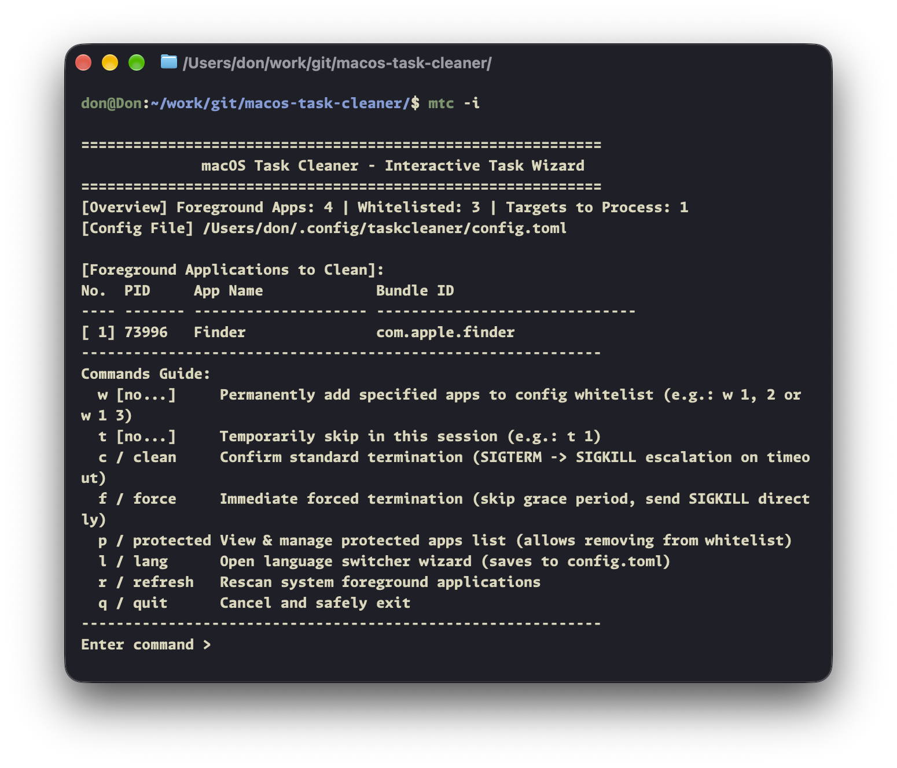
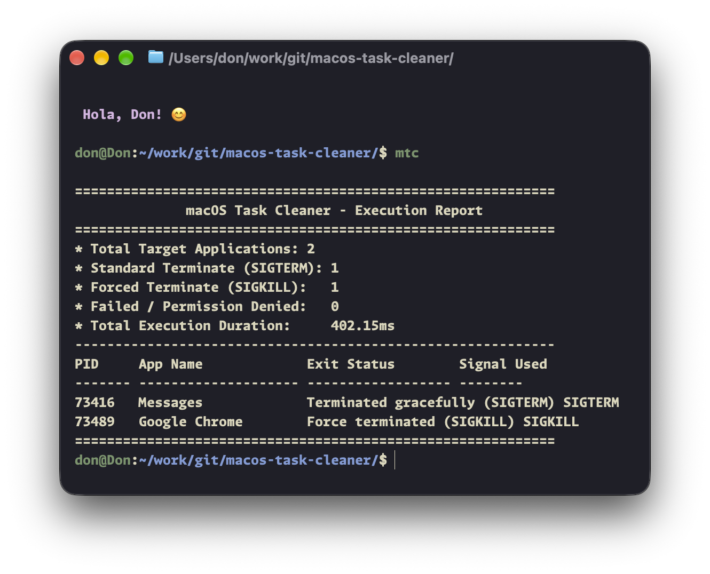
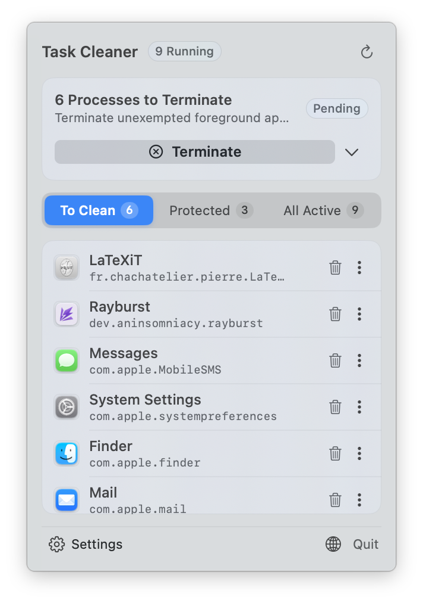

# macOS Task Cleaner CLI (`mtc` / `taskcleaner`)

<p align="left">
  <a href="README.md">English</a> | <a href="README_ZH.md">简体中文</a>
</p>

<p align="left">
  <a href="https://apple.com/macos"></a>
  
  <a href="https://www.rust-lang.org/"></a>
  <a href="https://brew.sh/"></a>
  
  <a href="LICENSE"></a>
  <a href="COMMERCIAL.md"></a>
</p>

A lightweight, production-grade foreground task cleaner and process management CLI for macOS. Built on top of the high-precision [macos-task-cleaner-core](https://github.com/macos-task-cleaner/macos-task-cleaner-core) engine.

---

## Interface Showcase

### 1. Interactive Console Wizard (`mtc -i`)

<p align="center">
  
</p>

### 2. Automated Batch Execution Report (`mtc --execute`)

<p align="center">
  
</p>

---

## Key Features

* **Interactive Task Wizard (`-i` / `--interactive`)**:
  Clean keyboard-driven terminal dashboard displaying foreground applications with real-time whitelist evaluation, live PID tracking, and index-based actions.
* **Non-Intrusive POSIX Escalation**:
  Bypasses modal save/confirm dialogs by orchestrating an orderly signal escalation sequence (`SIGTERM` soft termination -> 400ms polling grace period -> `SIGKILL` fallback).
* **Native AppKit Finder Voluntary Quit**:
  Correctly informs `launchd` via `NSRunningApplication.terminate()` when quitting Finder, preventing the OS from interpreting the exit as a crash and immediately respawning it.
* **4-Tier Whitelist Defense**:
  * **L1 Core OS**: Protects essential system daemons (`Dock`, `WindowServer`, `SystemUIServer`, `ControlCenter`, `NotificationCenter`, `loginwindow`) and `Finder`.
  * **L2 Context Shell**: Automatically resolves caller lineage (`PID` and `PPID`), immunizing active shells and developer environments (`Terminal`, `Ghostty`, `iTerm2`, `Alacritty`, `VS Code`).
  * **L3 Persistent Utilities**: Protects background menu bar utilities, window managers, and input methods (`Raycast`, `Alfred`, `Rectangle`, `Rime`, `Sogou`).
  * **L4 User Configuration**: Persistent rules defined in `~/.config/mtc/config.toml` (bundle IDs and names).
* **Instant Whitelist Rule Management (`-a` / `-r`)**:
  Add or remove persistent rules directly from the command line or inside the interactive console.
* **Pre-Flight Dry Run (`-n` / `--dry-run`)**:
  Analyze running applications and filter matches without terminating processes. Supports `--json` output for Raycast, Shortcuts, and automation scripts.

---

## Installation

### Option 1: Homebrew (Recommended)

```bash
# Add official tap repository
brew tap macos-task-cleaner/tap

# Install standalone CLI
brew install mtc

# Verify installation
mtc --version
```

### Option 2: Pre-Built Standalone Binaries

Download the pre-compiled binary package directly from [GitHub Releases](https://github.com/macos-task-cleaner/macos-task-cleaner-cli/releases/latest):

| Architecture | Applicable Hardware | Direct Download Link |
| :--- | :--- | :--- |
| **Apple Silicon** (`arm64`) | Apple M1 / M2 / M3 / M4 Macs | [mtc-macos-arm64.tar.gz](https://github.com/macos-task-cleaner/macos-task-cleaner-cli/releases/latest/download/mtc-macos-arm64.tar.gz) |
| **AMD64 / Intel** (`x86_64`) | Intel-based Macs | [mtc-macos-x86_64.tar.gz](https://github.com/macos-task-cleaner/macos-task-cleaner-cli/releases/latest/download/mtc-macos-x86_64.tar.gz) |
| **Universal** (`universal`) | Compatible with all Macs | [mtc-macos-universal.tar.gz](https://github.com/macos-task-cleaner/macos-task-cleaner-cli/releases/latest/download/mtc-macos-universal.tar.gz) |

Extract and place into your PATH:

```bash
tar -xzvf mtc-macos-arm64.tar.gz
sudo mv mtc /usr/local/bin/   # or ~/.local/bin/
```

### Option 3: Build from Source

Requires Rust toolchain (1.75+):

```bash
git clone https://github.com/macos-task-cleaner/macos-task-cleaner-cli.git
cd macos-task-cleaner-cli

# Build release binary
cargo build --release

# Install binary to local path
cp target/release/mtc ~/.local/bin/

# (Optional) Create alias symlink
ln -sf ~/.local/bin/mtc ~/.local/bin/taskcleaner
```

---

## Usage Guide

### 1. Interactive Wizard Mode (`mtc -i`)

```bash
mtc -i
# or
mtc --interactive
```

#### Interactive Commands Reference

| Command | Syntax | Description | Example |
| :--- | :--- | :--- | :--- |
| `w` | `w <indices>` | Permanently add apps to configuration whitelist | `w 2, 4` |
| `t` | `t <indices>` | Temporarily skip apps for current cleanup cycle | `t 1` |
| `c` / `clean` | `c` | Execute smooth tiered cleanup (`SIGTERM` -> grace period -> `SIGKILL`) | `c` |
| `f` / `force` | `f` | Immediately force kill non-whitelisted apps (`SIGKILL`) | `f` |
| `p` / `protected` | `p` | Inspect currently protected apps and whitelist tiers | `p` |
| `r` / `refresh` | `r` | Rescan running foreground applications from system | `r` |
| `q` / `quit` | `q` | Exit the wizard without terminating any processes | `q` |

### 2. Pre-Flight Preview (Dry Run)

```bash
# Scan and analyze without terminating processes
mtc --dry-run

# Temporarily exempt specific applications
mtc -k "WeChat" -k "Google Chrome" --dry-run

# Structured JSON output for scripting and Raycast extensions
mtc --json --dry-run
```

### 3. Quick Whitelist Management

```bash
# Add by application display name
mtc -a "MacVim"

# Add by Bundle Identifier (Recommended for precision)
mtc -a "com.spotify.client" -a "com.google.Chrome"

# Remove an application from whitelist
mtc -r "com.google.Chrome"

# List all configured whitelist rules
mtc --list-whitelist
```

### 4. Direct Cleanup Execution

```bash
# Execute standard tiered cleanup with confirmation prompt
mtc

# Execute immediate non-interactive cleanup (ideal for scripts/cron)
mtc --execute

# Force immediate termination bypassing grace periods
mtc --force

# Purge inactive memory cache after cleanup
mtc --execute --purge
```

---

## Command-Line Arguments Reference

```text
Usage:
  mtc [OPTIONS]   (or taskcleaner [OPTIONS])

Options:
  -i, --interactive         Interactive task wizard (Recommended: select by index, manage whitelist, confirm cleanup)
  -n, --dry-run             Pre-flight dry run mode (Scan and analyze without terminating processes)
  -e, --execute             Execute tiered cleanup sequence (SIGTERM -> polling -> SIGKILL)
  -f, --force               Force immediate termination bypassing grace periods (SIGKILL)
  -a, --add-whitelist <ID>  Add rule permanently to configuration whitelist (e.g. -a com.google.Chrome)
  -r, --remove-whitelist <ID> Remove rule from configuration whitelist
      --list-whitelist      List all configured whitelist rules
  -k, --keep <NAME/BUNDLE>  Temporarily exempt application for current invocation
  -p, --purge               Call /usr/sbin/purge after cleanup to reclaim inactive memory
  -c, --config <FILE>       Specify custom TOML configuration file path
      --init-config         Generate default configuration template at ~/.config/mtc/config.toml
      --json                Output results in structured JSON format
  -h, --help                Show help information
  -v, --version             Show version number
```

---

## Configuration

Configuration is located at `~/.config/mtc/config.toml` (compatible with `~/.config/taskcleaner/config.toml`):

```toml
[general]
# Polling grace period timeout before falling back to SIGKILL (in milliseconds, default: 400ms)
grace_period_ms = 400

# Default execution mode (false: execute cleanup; true: dry-run only)
default_dry_run = false

[whitelist]
# Whitelist by Bundle Identifier (Recommended)
bundle_ids = [
    "com.google.Chrome",
    "com.spotify.client",
    "com.tencent.xinWeChat",
]

# Whitelist by Application Display Name
names = [
    "Telegram",
    "Slack",
    "MacVim",
]
```

---

## Companion Graphical Interface

Prefer a native menu bar popover? Check out **[TaskCleaner.app](https://github.com/macos-task-cleaner/macos-task-cleaner-gui)**:

<p align="center">
  
</p>

---

## Related Projects

* **Core Engine Library (Rust)**: [macos-task-cleaner-core](https://github.com/macos-task-cleaner/macos-task-cleaner-core)
* **Native Menu Bar Application (SwiftUI)**: [macos-task-cleaner-gui](https://github.com/macos-task-cleaner/macos-task-cleaner-gui)

---

## License & Commercial Terms

This project is dual-licensed:

1. **Open-Source License**: Licensed under the **GNU Affero General Public License v3.0 (AGPLv3)** for individual, academic, and non-commercial open-source usage. Under this license, any derivative work, modification, or network-accessible service utilizing this codebase must release its complete corresponding source code under the AGPLv3. See [LICENSE](LICENSE) for details.
2. **Commercial License**: For enterprise deployment, proprietary closed-source bundling, white-labeling, or integration into commercial utilities where AGPLv3 compliance cannot be met, a separate commercial license is required. See [COMMERCIAL.md](COMMERCIAL.md) for licensing terms and acquisition details.
3. **Trademark Policy**: All product names, logos, and icon assets are protected. Forked distributions must be de-branded. See [TRADEMARK.md](TRADEMARK.md).

Copyright (c) 2026 DonJone. All rights reserved.
