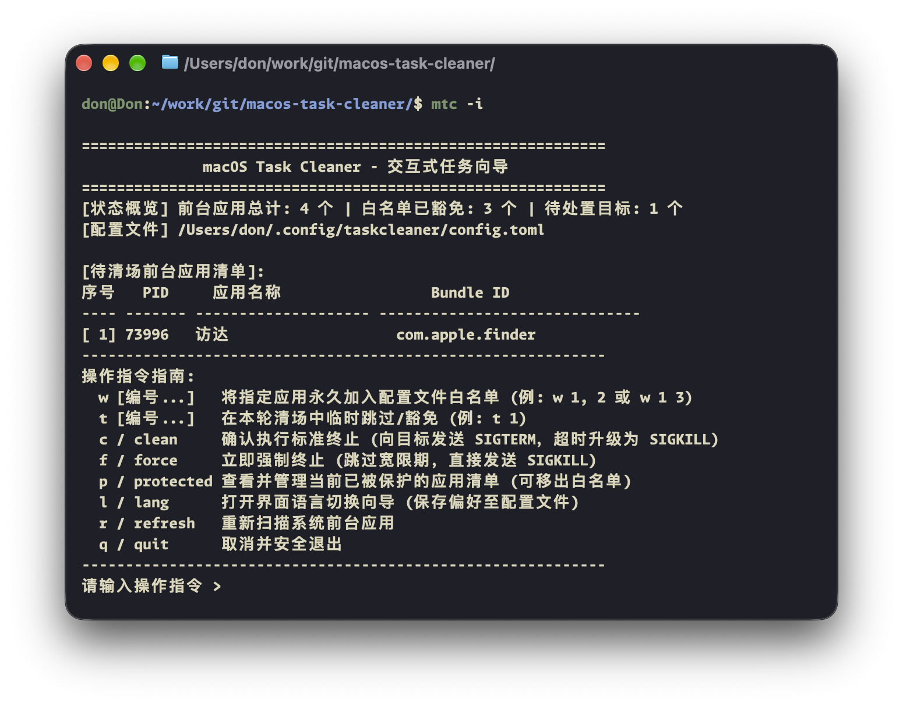
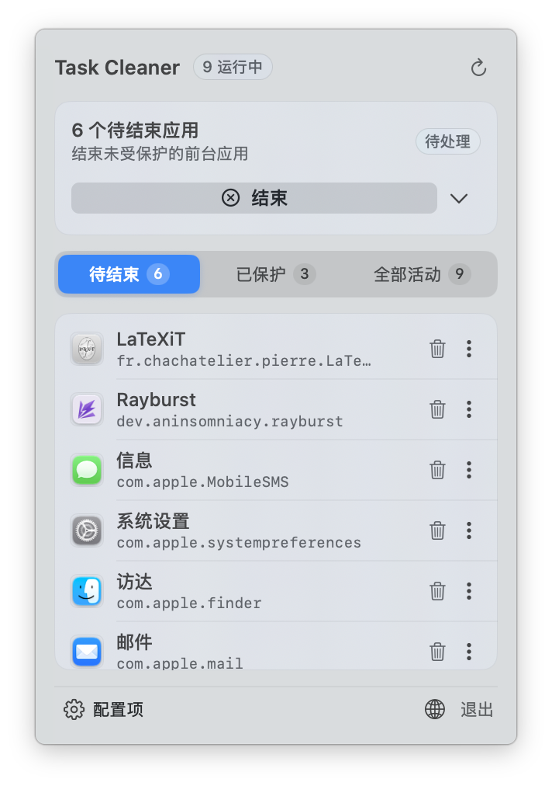

# macOS Task Cleaner CLI (`mtc` / `taskcleaner`)

<p align="left">
  <a href="README.md">English</a> | <a href="README_ZH.md">简体中文</a>
</p>

<p align="left">
  <a href="https://apple.com/macos"></a>
  
  <a href="https://www.rust-lang.org/"></a>
  <a href="https://brew.sh/"></a>
  
  <a href="LICENSE"></a>
  <a href="COMMERCIAL.md"></a>
</p>

面向 macOS 的轻量级、工程级前台任务清场命令行工具。基于底层高性能核心引擎 [macos-task-cleaner-core](https://github.com/macos-task-cleaner/macos-task-cleaner-core) 构建。

---

## 终端界面效果展示

### 1. 交互式向导控制台 (`mtc -i`)

<p align="center">
  
</p>

### 2. 批量清场执行与诊断报告 (`mtc --execute`)

<p align="center">
  
</p>

---

## 核心功能

* **交互式任务向导 (`-i` / `--interactive`)**：
  直观展示当前运行的所有前台图形应用与实时 PID，支持按序号一键加白、临时豁免、即时刷新与分级平滑清场。
* **非侵入式 POSIX 分级降级清场**：
  彻底绕过应用层阻塞式保存与确认弹窗，按序列平滑执行优雅退出协议（`SIGTERM` 软下线通知 -> 400ms 宽限期轮询 -> `SIGKILL` 兜底强退）。
* **原生 AppKit 访达 (Finder) 退出协议**：
  通过 `NSRunningApplication.terminate()` 退出访达，使系统守护进程 `launchd` 识别为自愿退出，彻底解决传统 POSIX `kill` 导致的“闪退又瞬间弹回”复活死循环。
* **四级白名单防御矩阵**：
  * **L1 系统核心层 (Core OS)**：保护 `Dock`、`WindowServer`、`SystemUIServer`、`ControlCenter`、`NotificationCenter`、`loginwindow` 与 `Finder`。
  * **L2 会话终端层 (Context Shell)**：自适应递归保护调用者 PID、父进程 PPID，以及常见开发终端与编辑器（`Terminal`、`Ghostty`、`iTerm2`、`Alacritty`、`VS Code` 等）。
  * **L3 常驻设施层 (Persistent Utilities)**：智能识别并豁免 `Raycast`、`Alfred`、`Rectangle`、输入法（鼠须管、搜狗）与系统监控小组件。
  * **L4 用户配置层 (User Config & CLI)**：从 `~/.config/mtc/config.toml` 持久化加载自定义白名单规则。
* **即时追加与移除白名单 (`-a` / `-r`)**：
  支持通过命令行参数直接管理白名单配置，自动去重持久化写入。
* **预检模式 (`-n` / `--dry-run`)**：
  仅输出待清场应用及白名单命中分析，不结束任何进程。支持 `--json` 输出结构化数据，方便与 Raycast、快捷指令或自动化脚本无缝对接。

---

## 安装与下载

### 方式一：通过 Homebrew 安装 (推荐)

```bash
# 添加官方 Tap 软件源
brew tap macos-task-cleaner/tap

# 安装独立命令行工具
brew install mtc

# 验证安装
mtc --version
```

### 方式二：预编译独立二进制包下载

前往 [GitHub Releases](https://github.com/macos-task-cleaner/macos-task-cleaner-cli/releases/latest) 直接获取适用于您当前 Mac 架构的压缩包：

| 硬件架构 | 适用设备 | 安装包直链下载 |
| :--- | :--- | :--- |
| **Apple Silicon** (`arm64`) | Apple M1 / M2 / M3 / M4 芯片 Mac | [mtc-macos-arm64.tar.gz](https://github.com/macos-task-cleaner/macos-task-cleaner-cli/releases/latest/download/mtc-macos-arm64.tar.gz) |
| **AMD64 / Intel** (`x86_64`) | Intel 处理器 / AMD64 架构 Mac | [mtc-macos-x86_64.tar.gz](https://github.com/macos-task-cleaner/macos-task-cleaner-cli/releases/latest/download/mtc-macos-x86_64.tar.gz) |
| **Universal** (`universal`) | 兼容全部 Apple Silicon 及 Intel Mac | [mtc-macos-universal.tar.gz](https://github.com/macos-task-cleaner/macos-task-cleaner-cli/releases/latest/download/mtc-macos-universal.tar.gz) |

解压后放置于 PATH 环境变量目录下即可使用：

```bash
tar -xzvf mtc-macos-arm64.tar.gz
sudo mv mtc /usr/local/bin/   # 或 ~/.local/bin/
```

### 方式三：源码本地编译

要求已安装 Rust 工具链（1.75+）：

```bash
git clone https://github.com/macos-task-cleaner/macos-task-cleaner-cli.git
cd macos-task-cleaner-cli

# 编译 Release 二进制文件
cargo build --release

# 安装主命令到可执行路径
cp target/release/mtc ~/.local/bin/

# (可选) 创建别名软链接
ln -sf ~/.local/bin/mtc ~/.local/bin/taskcleaner
```

---

## 使用指南

### 1. 交互式向导模式 (`mtc -i`)

```bash
mtc -i
# 或
mtc --interactive
```

#### 交互式指令速查表

| 指令 | 语法示例 | 说明 |
| :--- | :--- | :--- |
| `w` | `w 2, 4` | 将指定序号的应用永久加入配置文件白名单 |
| `t` | `t 1` | 在本轮清场中临时跳过/豁免指定应用 |
| `c` / `clean` | `c` | 确认执行平滑清场（`SIGTERM` -> 宽限期轮询 -> `SIGKILL`） |
| `f` / `force` | `f` | 跳过宽限期直接强制秒杀所有未受保护的前台任务（`SIGKILL`） |
| `p` / `protected` | `p` | 查看当前受白名单保护的完整应用清单及对应保护层级 |
| `r` / `refresh` | `r` | 重新扫描系统活跃的前台应用 |
| `q` / `quit` | `q` | 安全退出向导，不执行任何清理 |

### 2. 预检模式 (Dry Run)

```bash
# 扫描并分析待清理目标，不结束任何进程
mtc --dry-run

# 临时跳过/保留特定应用
mtc -k "微信" -k "Google Chrome" --dry-run

# 结构化 JSON 格式输出 (适配自动化工作流)
mtc --json --dry-run
```

### 3. 白名单管理

```bash
# 按应用显示名追加白名单
mtc -a "MacVim"

# 按 Bundle Identifier 追加白名单 (推荐，防重名)
mtc -a "com.spotify.client" -a "com.google.Chrome"

# 从白名单中移除特定规则
mtc -r "com.google.Chrome"

# 查看当前生效的全部白名单规则
mtc --list-whitelist
```

### 4. 批量清理与自动化执行

```bash
# 默认清场 (清理前进行确认提示)
mtc

# 静默立即执行平滑清场 (适用于定时任务或自动化脚本)
mtc --execute

# 立即强制强退 (直接发送 SIGKILL)
mtc --force

# 清理完成后调用系统 purge 释放不活跃内存
mtc --execute --purge
```

---

## 命令行参数一览

```text
用法:
  mtc [选项]   (或 taskcleaner [选项])

选项:
  -i, --interactive         进入交互式向导 (推荐: 按序号选定、管理白名单、确认清理)
  -n, --dry-run             预检预览模式 (仅扫描分析，不杀任何进程)
  -e, --execute             执行分级平滑清场 (SIGTERM -> 轮询宽限期 -> SIGKILL)
  -f, --force               强制秒杀所有未加白前台进程 (跳过宽限期直接下发 SIGKILL)
  -a, --add-whitelist <ID>  向配置文件永久追加白名单规则 (例如: -a com.google.Chrome)
  -r, --remove-whitelist <ID> 从配置文件中移除白名单规则
      --list-whitelist      列出当前生效的所有白名单配置
  -k, --keep <名称/BUNDLE>  在当前执行周期中临时豁免指定应用
  -p, --purge               清理完成后调用 /usr/sbin/purge 释放不活跃内存
  -c, --config <文件路径>    指定自定义 TOML 配置文件
      --init-config         在 ~/.config/mtc/config.toml 初始化默认配置模板
      --json                以结构化 JSON 格式输出扫描与清理结果
  -h, --help                显示帮助说明
  -v, --version             显示版本号
```

---

## 配置文件规范

配置文件默认位于 `~/.config/mtc/config.toml`（亦向前兼容 `~/.config/taskcleaner/config.toml`）：

```toml
[general]
# 宽限期轮询超时时长 (单位: 毫秒，默认 400ms)
grace_period_ms = 400

# 默认是否以 --dry-run 预检模式运行 (true: 仅扫描分析; false: 直接执行清理)
default_dry_run = false

[whitelist]
# 用户自定义白名单 - 按 Bundle Identifier 豁免 (推荐)
bundle_ids = [
    "com.google.Chrome",
    "com.spotify.client",
    "com.tencent.xinWeChat",
]

# 用户自定义白名单 - 按应用显示名称豁免
names = [
    "Telegram",
    "Slack",
    "MacVim",
]
```

---

## 原生图形化伴随应用

如果您更习惯在状态栏一键点击清理，欢迎使用基于 SwiftUI 构建的 **[TaskCleaner.app](https://github.com/macos-task-cleaner/macos-task-cleaner-gui)**：

<p align="center">
  
</p>

---

## 关联项目与组件

* **底层核心引擎库 (Rust)**: [macos-task-cleaner-core](https://github.com/macos-task-cleaner/macos-task-cleaner-core)
* **原生状态栏应用 (SwiftUI)**: [macos-task-cleaner-gui](https://github.com/macos-task-cleaner/macos-task-cleaner-gui)

---

## 许可协议与商业授权

本项目采用双重授权模式（Dual-Licensing Model）：

1. **开源许可证**：遵循 **GNU Affero General Public License v3.0 (AGPLv3)** 协议。个人学习、学术研究与非商业开源项目可免费使用与修改；凡修改或基于本项目构建衍生作品（包括通过网络提供交互服务的 SaaS / 云端调用形态），均须向公众无偿开源全部衍生代码。详见 [LICENSE](LICENSE)。
2. **商业许可协议 (Commercial License)**：面向企业客户、闭源专有产品集成、白标重命名销售或无法遵守 AGPLv3 传染性条款的商业场景，必须事先取得商业授权许可证。详见 [COMMERCIAL.md](COMMERCIAL.md)。
3. **商标与品牌保护**：项目名称、标识图形与应用图标均受版权及商标保护。任何二次分发或分叉 (Fork) 版本必须彻底去除官方品牌元素。详见 [TRADEMARK.md](TRADEMARK.md)。

Copyright (c) 2026 DonJone. 保留所有权利。
